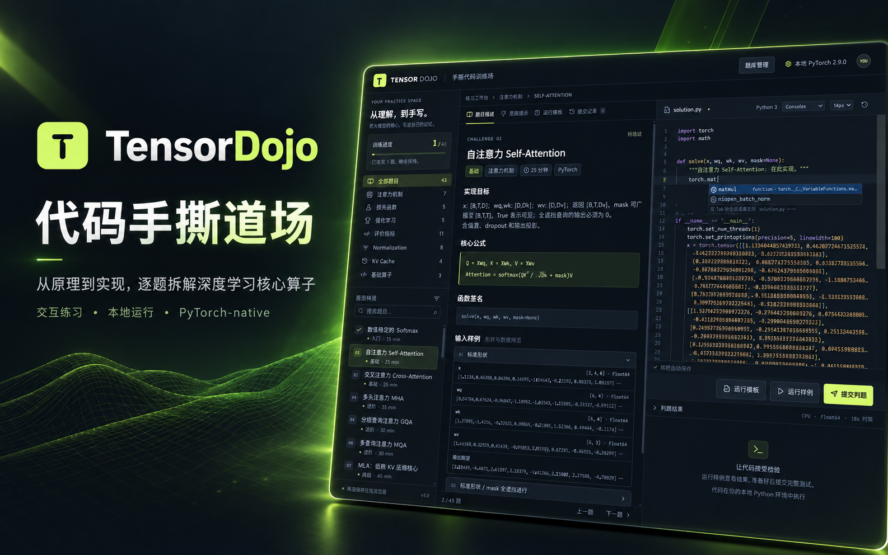

# Tensor Dojo · 手撕代码训练场



本地运行的中文深度学习 / 大模型代码训练项目。React + Monaco Editor 前端，Python 标准库 HTTP 服务 + PyTorch CPU 判题，SQLite 保存提交记录。不需要云端账号、外部判题服务或 GPU。

## 它能帮你解决什么

- 🧠 **理论会了，代码不会写**：把注意力机制、Normalization、损失函数、评价指标、KV Cache、强化学习等核心算法变成可手写的题目，让你从“看懂了”走到“写对了”。
- ⚡ **缺少合适的本地练习场**：打开浏览器就能练，不需要云端账号、GPU 或外部判题服务。
- ✅ **不确定实现是否正确**：内置 PyTorch 参考实现与随机回归测试，逐项检查数值、形状和梯度，失败时展开具体断言。
- 🔒 **代码不想离开本机**：判题、草稿和提交记录都保存在本地，适合离线、内网或隐私敏感环境。
- 📚 **卡住时缺乏引导**：每题提供核心公式、输入样例、逐条提示和可选参考实现，能循序渐进地提示，而不是直接给出答案。
- 📈 **练习没有体系**：题目按分类组织，自动记录完成进度，支持只看未完成，逐步建立肌肉记忆。
- 🧩 **想扩充自己的题库**：前端可直接新建、编辑、复制、导入和导出题目，把公司或课程中的自定义算法纳入训练。

## 启动

```bash
cd tensor-dojo
./start.sh
```

打开 http://127.0.0.1:8765 。启动脚本会安装缺失的 npm 依赖、构建前端并启动服务。构建后的编辑器资源全部本地加载，无 CDN 依赖。

默认先检查当前 `python` 的 PyTorch。可以指定其他环境：

```bash
DOJO_PYTHON=/path/to/venv/bin/python ./start.sh
# 自定义端口（生产模式）
DOJO_PORT=8766 ./start.sh
```

需要 Node.js 20.19+ / 22.12+，Python 3.10+ 和 PyTorch 2.2+。缺少 PyTorch 时，在自行选择的 Python 环境安装 `requirements.txt`。本项目没有修改已有 Python 环境。

### 开发模式

```bash
# 终端 1
/path/to/python backend/server.py --port 8765
# 终端 2
npm ci
npm run dev
```

打开 http://127.0.0.1:5173 ，Vite 将 `/api` 转发到本地 8765 端口。

## 练习方式

- 在题库中按分类或关键词选择题目，也可只看未完成。
- 阅读形状、mask、返回值与公式约定，然后实现 `solve`。
- **运行样例**：2 组公开输入，不记入通过状态。快捷键 `Ctrl+Enter`。
- **提交判题**：所有测试场景 × 3 个随机种子，检查输出与题目要求的自动微分（指标/缓存按推理判题）；写入本地提交记录。快捷键 `Ctrl+Shift+Enter`。
- 失败用例展开后显示具体断言；标准输出单独展示，最多 16000 字符。
- 思路提示逐条展开；参考实现只在主动查看时展示，不自动填入编辑器。
- 草稿按题保存在当前浏览器的 localStorage，提交历史持久化在 `data/progress.sqlite3`。不同端口/浏览器的草稿互不共享；后端提交记录共享。

## 43 道题目

| 分类 | 题目 |
| --- | --- |
| 注意力机制 · 7 | 自注意力、交叉注意力、MHA、GQA、MQA、MLA 低秩核心、MLA 解耦 RoPE |
| 损失函数 · 5 | 交叉熵、BCE with logits、MSE、蒸馏 KL、Focal Loss |
| 基础算子 · 3 | Softmax、RoPE、SwiGLU |
| 强化学习 · 5 | PPO、GAE、GRPO 组内优势、GRPO token 损失、DPO |
| 评价指标 · 11 | Accuracy、Precision、Recall、F1、混淆矩阵、Macro-F1、Top-k Accuracy、ROC-AUC、Average Precision、IoU、Dice |
| Normalization · 8 | RMSNorm、LayerNorm、BatchNorm1d、BatchNorm2d、InstanceNorm2d、GroupNorm、多维 LayerNorm、L2 Normalize |
| KV Cache · 4 | 追加缓存、增量因果注意力、GQA/MQA 共享缓存、滑动窗口与分块解码 |

推荐顺序：基础算子 → Normalization → 注意力 → KV Cache → 损失函数与评价指标 → PPO/GAE/GRPO/DPO。

## 每题独立运行模板

全部 43 道题都在 `practice_templates/` 提供独立 `.py` 文件，包含函数签名、TODO、固定公开输入、期望输出、调用入口和数值断言。例如：

```bash
python practice_templates/f1.py
python practice_templates/batchnorm2d.py
python practice_templates/kv-cache-decode.py
```

未补全时提示“请先补全 solve”；补全后运行单个快速样例并输出实际/期望值。不需要启动网页即可练习。

页面的 **运行模板** 选项卡可查看、复制或下载模板；“补充运行入口”只向当前草稿追加入口，不覆盖已有实现。编辑器下方 **运行模板** 按钮执行当前代码的 `__main__`（没有入口时临时补充），不写入成绩。原来的“运行样例”和“提交判题”仍使用题库测试，不执行 `__main__`。

新增题目后可运行 `python scripts/export_templates.py` 导出缺失模板；该脚本保留已存在的文件，不覆盖你的练习代码。旧草稿、原题 ID 和历史记录不变。

### 算法约定

- 评价指标题不要求梯度；Precision/Recall/F1 的零分母返回 0，IoU/Dice 的双空掩码返回 1。
- ROC-AUC 用原始排序分数，正负样本同分计 0.5；AP 按唯一阈值分组处理并列分数，使用 Recall 增量加权 Precision，不做梯形积分。
- BatchNorm 前向用总体方差，running variance 更新用无偏方差；支持训练/推理，返回新统计量而不原地修改输入。InstanceNorm 沿每个样本每个通道的空间轴计算，GroupNorm 沿组内通道和空间轴计算。
- KV Cache 题按推理方式判题；Q/K 已应用位置编码。分块因果 mask 使用历史长度偏移，GQA 缓存保留 KV 头数，滑动窗口对每个新查询分别构造可见区间。

- mask 的 `True` 表示可见，注意力全遮挡行输出 0。
- GQA 按连续 query heads 分组，共享 KV；MQA 的 KV head 数为 1。
- MLA 分为两个明确标注的教学子问题。低秩核心不含位置编码；解耦 RoPE 题的 qr/kr 已完成旋转，使用 `sqrt(Dc+Dr)` 缩放。两题均不等同于完整生产模型。
- RoPE 使用相邻偶奇维配对（interleaved），而非 split-half。
- GRPO 优势使用总体标准差 `std(unbiased=False) + eps`，明确作为本题约定；不同实现可能使用不同标准差约定。
- GRPO loss 先按每条回答的有效 token 平均，再平均非空回答；实现 clipped surrogate + k3 KL 估计。不是完整强化学习训练流水线。
- GAE 将真正终止与时间截断区分；本题 `dones` 仅表示真正终止。
- 测试使用 float64、小尺寸 CPU 张量。输出容限 rtol=1e-5 / atol=1e-7，梯度容限 rtol=2e-5 / atol=1e-7。训练目标/旧策略/参考策略的停止梯度也在检查范围内。

题目中的论文或官方文档入口可追溯定义：[Attention](https://arxiv.org/abs/1706.03762)、[GQA](https://arxiv.org/abs/2305.13245)、[DeepSeek-V2 / MLA](https://arxiv.org/abs/2405.04434)、[PPO](https://arxiv.org/abs/1707.06347)、[DeepSeekMath / GRPO](https://arxiv.org/abs/2402.03300)。

## 判题边界

这是个人本地练习工具，**不是用于运行恶意代码的安全沙箱，也不提供防作弊保证**。提交的 Python 代码拥有启动服务账户的本地权限，只应运行你信任的代码，不要将判题 API 暴露到公网。

已有防误用措施：仅监听 `127.0.0.1`、Host/Origin 校验、会话 token、防跨站执行请求、100 KB 请求上限、最多 2 个并发判题进程、每次独立临时工作目录、CPU 10 秒 / 总计 18 秒超时、子进程组清理、输出截断。没有容器、文件系统/网络隔离或严格内存隔离；练习限制中的 AST 检查用于提醒手写要求，不能防止蓄意绕过。

## 测试与扩展

```bash
/path/to/python -m unittest discover -s tests -v
npm run build
# 服务已启动时的 API 冒烟测试（不写入成绩）
python scripts/check_api.py
```

- `backend/catalog.py`：题目数据、参考函数、测试场景工厂；用 `add(...)` 注册题目。
- `backend/extra_catalog.py`：评价指标、Normalization 与 KV Cache 题库。
- `backend/templates.py`：每题独立运行入口和公开输入生成。
- `backend/worker.py`：独立判题进程，比较返回形状、数值与随机向量加权梯度。
- `backend/server.py`：本地 API、进程管理、SQLite 提交记录、生产静态页面服务。
- `frontend/src/main.jsx`：题库、Monaco 编辑器、提示、历史、判题面板。
- `frontend/src/style.css`：深色响应式工作台主题。

增加题目时，需写清维度、数值稳定性、mask 与梯度约定，并加入至少一个能区分常见错误实现的边界场景。

## 维护 / 导入 / 导出题库

页面右上角点击 **题库管理**，即可新建、编辑、复制、删除与恢复题目，以及单题、勾选批量或全量导出。导入支持选择 JSON 文件或粘贴内容，先预检，再确认写入；同 ID 覆盖需要显式勾选。编辑器支持题目说明、参考实现、练习模板、测试数据与判题规则，保存前自动校验。

详见 [题库管理接口文档](docs/question-bank.md)，完整示例在 [examples/question-bank.json](examples/question-bank.json)。

```bash
python scripts/bank_cli.py list
python scripts/bank_cli.py export -o question-bank-backup.json
python scripts/bank_cli.py validate examples/question-bank.json
python scripts/bank_cli.py import examples/question-bank.json --dry-run
# 确认预检结果后导入
python scripts/bank_cli.py import examples/question-bank.json
```

支持 API / CLI 新增、完整更新、可恢复删除、恢复、批量校验、按题导出与全量导出。写入使用全局版本检查与原子持久化，服务无需重启，刷新页面即可看到新增题目。
